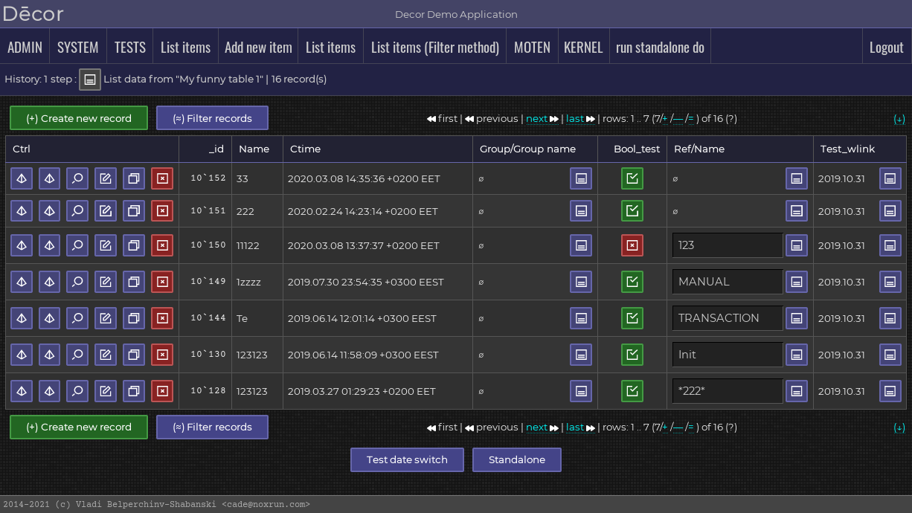

#  DECOR APPLICATION MACHINERY
##   2014-2017 (c) Vladi Belperchinov-Shabanski "Cade"

#  INTRODUCTION

DECOR is Perl infrastructure for building general purpose information
systems/applications.

DECOR includes set of libraries and database tools, client-server host apps
and user interface protocols. DECOR automates wide range of routine work:

    * database (re)structuring
    * user management
    * security management
    * business logic security and execution
    * client-server data interaction (server api, client api, protocols)
    * data entry and other client-side forms/screens management

DECOR automates further those tasks with:

    * single-source DB structure and data-input objects description
    * online restructuring of the database schema on demand
    * security policies constructor and automatic checks
    * automatic data-entry objects/screens generation
    * user server session management
    * user, page/screen and linked-data client session management

DECOR is written entirely in Perl 5, but client apps can be in any language.

DECOR is licensed under GPLv2, for full text see file "COPYING".

Further documentation can be found in the  directory.

Screenshots of a reference web interface can be found in 
 directory.

Questions, please, send to:

    Vladi Belperchinov-Shabanski "Cade"
    <cade@bis.bg> <cade@biscom.net> <cade@cpan.org>
    https://github.com/cade-vs
    github repo: git@github.com:cade-vs/perl-decor.git
